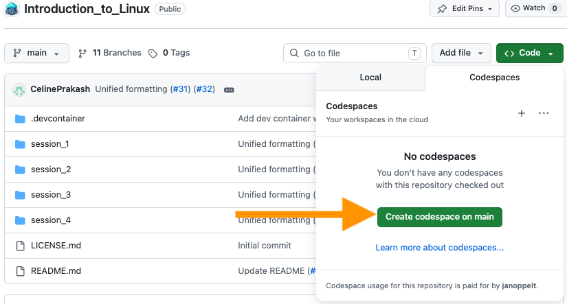
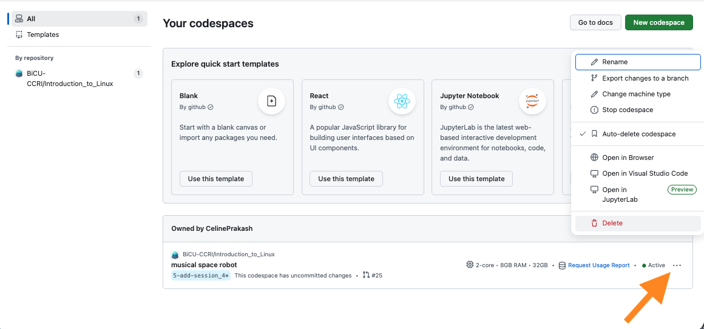
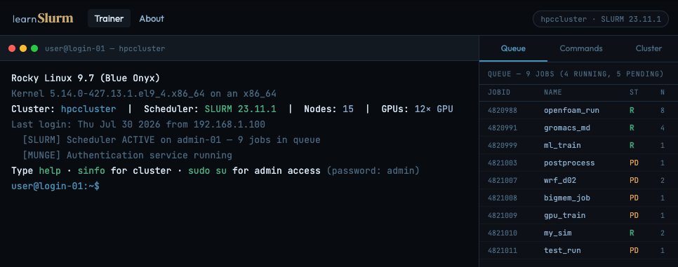

# Introduction to Scientific Computing

The Introduction to Scientific Computing course is for St. Anna CCRI users who want to learn how to utilize the computational infrastructure (the CeMM cluster) to analyze scientific data.

## Session Contents

Below you can find a description of the topics that will be covered in each session.

### Session 1 – Shell, scripts, and environments (Codespaces)

1. Exercise 1: Running simple commands using the command line  
2. Exercise 2: Running a simple `.sh` script, redirection, and piping  
3. Exercise 3: Running a simple scientific computing script  
4. Exercise 4: Environment management using Conda
5. Exercise 5: Activating a Conda environment in a script  
 
### Session 2 – Variant calling (Codespaces)

1. Intro to the project, sequencing data formats, and the somatic variant calling workflow
2. Exercise 1: Setting up your project
3. Exercise 2: Read QC and trimming
4. Exercise 3: Alignment
5. Exercise 4: Marking PCR duplicates,
6. Exercise 5: Base quality score recalibration (BQSR)
7. Exercise 6: Variant calling
 
### Session 3 – SLURM basics (Codespaces)

1. Exercise 1: Learning when to use a compute node instead of a login node  
2. SLURM basics  
3. SLURM directives  
4. SLURM queues  
5. Exercise 2: Using `srun` to start an interactive job  
6. Exercise 3: Running simple commands and scripts using the command line on a compute node via an interactive job  
7. Exercise 4: Running a simple `.sbatch` script on a compute node  
8. Exercise 5: Useful commands to track cluster usage and job status  
 
### Session 4 – Variant calling and interactive work on the CeMM cluster (CeMM cluster)

1. Exercise 1: Logging onto the CeMM cluster using SSH  
2. Understanding the CeMM cluster architecture  
3. Understanding the CeMM cluster file storage systems  
4. Exercise 2: Creating your workspace for session 4
5. Exercise 3: Environment management using the module system
6. Exercise 4: Variant calling on the CeMM cluster
7. Exercise 5: Running a Jupyter Notebook session on the CeMM cluster 
8. Exercise 6: Running an RStudio session on the CeMM cluster 

## Prerequisites

### Required pre-requisites

- Intro to Linux (or pre-existing basic knowledge of Linux commands and bash scripting)

- [GitHub](https://github.com/signup) account (free) with enough Codespaces (minimum of 20 hours usage left)

### Recommended pre-requisites

- CeMM cluster account  
  If you don't have one, you can still take Sessions 1-3, but you might want to skip Session 4, which is tailored specifically to CeMM cluster users. If you don't have a CeMM cluster account, you can also join somebody who does and go through Session 4 together. We **recommend joining Session 4,** even if you don't have a CeMM cluster account, to get a full overview of the process for working at the CeMM cluster. 

If you have a CeMM cluster account:  

- Visual Studio Code (VSCode)  
  Newer versions are incompatible with the CeMM cluster so we recommend downloading **version 1.100.3** as a portable version by following the instructions at [Working on the CeMM cluster Analytics/Tips and practical information/VS Code/Supported VS Code versions](https://confluence.ccri.at/spaces/BiKB/pages/119799933/Tips+and+practical+information#Tipsandpracticalinformation-SupportedVSCodeversions)

- "[Remote - SSH](https://marketplace.visualstudio.com/items?itemName=ms-vscode-remote.remote-ssh)" extension enabled on VSCode  
  This extension is required to connect to the CeMM cluster - please install and enable it in your VSCode by following these instructions:
  1. Navigate to the "Extensions" tab in VSCode (`Ctrl + Shift + X` on Windows; `Cmd + Shift + X` on Mac)  
  2. Search for "Remote - SSH"
  3. Click "Install"  

## A guide to GitHub Codespaces

For Sessions 1 and 2, we will use Github Codespaces to provide a cloud-based Linux environment that allows you to run code in a virtual machine. You can access it through your web browser, and it provides a similar experience to using a Linux machine (e.g., the CeMM cluster). It doesn't require any additional software to be installed on your computer.

### Setting up GitHub Codespaces

1. Scroll back to the top of this GitHub repo.
2. Click the green **Code** button.
3. Select the **Codespaces** tab.
4. Click **Create codespace on main**.
5. Wait for the environment to build - this can take a few minutes the first time.

Once it is ready, you will have a complete Linux environment running in your browser, including a terminal where you can run commands. All participants have the same Linux environment, which makes it easier to share the code and go through the tutorials.

You can experiment freely in this environment — if something goes wrong, you can always restart the Codespace or return to the original course files. It doesn't have access to your local files, so don't be afraid to play around.  

### Managing GitHub Codespaces

> [!NOTE]
> GitHub Codespaces is free for individual users within the included monthly usage allowance (currently up to 60 hours per month). This should be sufficient to complete this introductory course. If you leave your Codespace open or stop working for the day, it will automatically stop after 30 minutes of inactivity. Your files will be saved, and you can restart the Codespace when you return.

You can view and manage your Codespaces at [https://github.com/codespaces](https://github.com/codespaces). Click the `...` options menu next to a Codespace. There you can find options to stop or delete it. Remember, **stopping** pauses the environment while keeping your work. 

**When you have finished using Codespaces:** Remember to delete your Codespace if you no longer need it. Codespaces that are left unused can continue to count towards your storage and usage limits. You can always create a new Codespace from this repository again in the future if needed.

>[!TIP]
>Stopping the Codespace before going for lunch can save you 30 minutes of free allocated usage. Delete a Codespace only when you have finished with it.

## A guide to LearnSlurm

If Codespaces doesn't work for Session 3, our backup is [LearnSlurm](https://learnslurm.com/index), a free online platform that allows you to practice using SLURM commands in a simulated environment. It provides a virtual cluster where you can submit jobs, manage queues, and learn SLURM commands without needing access to the CeMM cluster.  

### Setting up LearnSlurm

1. Go to [https://learnslurm.com/index](https://learnslurm.com/index)

2. Select "> Launch Trainer" to start the SLURM training environment.

You now have a fake high-performance computing cluster running in your browser, including a terminal where you experiment with common SLURM commands. Similarly to Codespaces, LearnSlurm also doesn't have access to your local files, so you can play around without being worried about deleting anything by accident.  