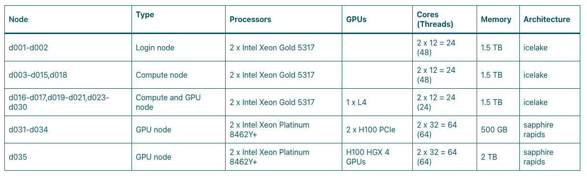

# Introduction to Scientific Computing - Session 4  

Welcome to Session 4 of the Introduction to Scientific Computing course! For this session, we will be focusing on running
 interactive RStudio and Jupyter Notebook on the CeMM cluster.  

If you don't have access to the CeMM cluster, please join a colleague who does.

## Overview
  
Today we'll cover:  

1. Exercise 1: Logging onto the CeMM cluster using SSH  
2. Understanding the CeMM cluster architecture  
3. Understanding the CeMM cluster file storage systems  
4. Exercise 2: Creating your workspace for session 4
5. Exercise 3: Environment management using the module system
6. Exercise 4: Variant calling on the CeMM cluster
7. Exercise 5: Running a Jupyter Notebook session on the CeMM cluster
8. Exercise 6: Running an RStudio session on the CeMM cluster

## 1. Exercise 1: Logging onto a computing cluster using SSH  

**Goal:** Learn how to log onto the CeMM cluster using SSH from a terminal or VS Code.

The first step to accessing the CeMM cluster, or any high-performance computing cluster, is to log in using SSH (Secure Shell).
 SSH is a protocol that allows you to securely connect to a remote server or computer over a network.  

### Logging onto the CeMM cluster from the terminal  

1. Make sure you are connected to the St. Anna CCRI network (either on-site at St. Anna CCRI or via VPN).  

2. Open a terminal on your local machine (Linux or Mac) or use a terminal emulator like [MobaXterm](MobaXterm) or [PuTTY](https://putty.org/index.html) on Windows.  

>[!TIP]
>You can also use [Windows Subsystem for Linux](https://learn.microsoft.com/en-us/windows/wsl/install) (WSL) if you have it installed on your Windows. 

3. Use the following command to connect to the CeMM cluster:  

   ```bash
   ssh <username>@login.int.cemm.at
   ```

4. Enter your CeMM password when prompted.  

### Logging onto the CeMM cluster using VS Code  

1. Open VS Code.  

2. Cmd + Shift + P (Mac) or Ctrl + Shift + P (Windows) to open the command palette.  

3. Type "Remote-SSH: Connect to Host..." and select it.

>[!TIP]
>You can also use the small `><` green button at the bottom left and select "Connect to Host...    Remote-SSH".
>
>

4. Enter the following in the input box: `<username>@login.int.cemm.at` and press Enter.  

5. Enter your CeMM password when prompted.  

Voilà! You are now logged onto the CeMM cluster. You should see a command prompt indicating that you are on the cluster:

```bash
############################################################################
Cluster details and information:
https://cemmat.sharepoint.com/sites/IT-Resources/SitePages/Lustre-Cluster.aspx

Required Metadata information:
https://cemmat.sharepoint.com/sites/data-management
############################################################################
```

If the terminal didn't pop up, you should at least see ">< SSH: login.int.cemm.at" at the small green button at bottom left.


You can now start running commands and jobs on the cluster. How exciting.  

#### Common VS Code SSH login issues

If you get errors such as:

- `Corrupted MAC on input`
- `authentication method incorrect`

you may need to modify your SSH configuration file.

**Linux/Mac**

```bash
~/.ssh/config
```

**Windows**

```bash
C:\Users\<username>\.ssh\config
```

If the configuration file does not already exist, create it and add:

```bash
Host login.int.cemm.at
    Hostname login.int.cemm.at
    User <your_cemm_username>
    MACs hmac-sha2-512
```

This resolves a common SSH compatibility issue when connecting to the CeMM cluster through VS Code. For more info, please
 see the [BiCU Knowledgebase](https://confluence.ccri.at/spaces/BiKB/pages/119799933/Tips+and+practical+information#Tipsandpracticalinformation-SupportedVSCodeversions).

## 2. Understanding the CeMM cluster architecture

The CeMM cluster is a high-performance computing environment that consists of multiple nodes, each with its own resources (CPU, memory, storage). The cluster is designed to handle large-scale computations and data analysis tasks.

When you first log in, you are on a **login node**. Login nodes are used for interactive tasks such as editing files, writing code, and submitting jobs. However, they are not meant for running long computations or resource-intensive tasks.

To run more computationally intensive jobs, you must use a **compute node**. Compute nodes are designed to handle heavy workloads and can be accessed by submitting jobs through a job scheduler (SLURM). We went over SLURM and how to submit jobs to compute nodes in the previous session.  

Here is an overview of the different node types currently available on the CeMM cluster:



### Choosing between login nodes and compute nodes

As a general rule:

| **Task** | **Where should it run?** |
| -------- | ------------------------ |
| Listing files and directories | Login node |
| Editing files or writing scripts | Login node |
| Checking job status | Login node |
| Running a bioinformatics analysis | Compute node |
| Downloading large datasets | Compute node |
| Generating plots from a large dataset | Compute node |
| Testing pipelines, even on small datasets | Compute node |
| Tasks with unknown memory or runtime requirements | Compute node |

When in doubt, use a compute node. Even small jobs consume resources on the shared login nodes.

#### Why this matters

The CeMM cluster currently has hundreds of users sharing only a small number of login nodes. Running analyses directly on
 login nodes can negatively affect other users. Login nodes should be reserved for:

- Editing files
- Writing code
- Submitting jobs
- Monitoring jobs

All computational work should be submitted through SLURM and executed on compute nodes.

## 3. Understanding the CeMM cluster file storage systems  

The CeMM cluster has two main file storage systems: `/nobackup` and `/research`. Each of these storage systems serves different purposes and has different characteristics.  

- `/research` : This is a backed-up file system used by the groups for storing the most important data (for example, raw data). St. Anna CCRI research groups have limited storage available on `/research` and we only use it in rare cases, since our main and backed-up storage system is the Isilon file system hosted at the St. Anna CCRI. CeMM research groups or adjunct PIs generally have more storage on `/research`.

- `/nobackup`: As the name suggests, this is a non-backed-up file system that is used for temporary storage of data and files, for example, while running analyses. This is the main file system that we will use as St. Anna CCRI users. Each lab has a dedicated folder in `/nobackup` where they can store their data and files. The path to your lab's folder is `/nobackup/<lab_name>`. Lab names are usually assigned as `lab_<PI_last_name>`.  

Let's take a look at what your lab already has in `/nobackup` by running the following command on the login node:

>[!TIP]
>If you are using VS Code and don't see a terminal window, select "Terminal" and "New Terminal" at the very top
>
>

```bash
ls /nobackup/<lab_name>
```  

Both `/nobackup` and `/research` have storage quotas that limit the amount of data that can be stored per group.  

Let's check how much storage your lab is currently using by running the following commands on the login node:

```bash
lfs quota -h -g <lab_name>
```

<details>
<summary>lfs quota columns</summary>

**Storage quota (Space usage/Block)​**:

- **Filesystem**: The name or mount point of the storage system (e.g., `/home`, `/nobackup`, `/research`).​
- **used**: The total amount of disk space currently consumed by your files.​
- **bquota**: (Block soft limit / Quota): Your soft limit for storage space. You can temporarily exceed this amount, but a
- **grace**: period timer will start.​
- **blimit**: (Block hard limit): Your hard limit for storage space. You cannot exceed this value under any circumstances.
- **writes**: will fail immediately if reached.​
- **bgrace**: (Block grace period): The time remaining to bring your used space back below bquota once you have exceeded it. If this timer expires, your soft limit converts into a hard stop, and you cannot write new data.​

**File count quota (Number of files/Inode)​**:

- **files**: The total count of individual files, directories, and symlinks currently owned by you/your group on this filesystem.​
- **iquota**: (Inode soft limit / Quota): Your soft limit for total file count. Exceeding this triggers the inode grace timer.​
- **ilimit**: (Inode hard limit): Your absolute ceiling for file count. Once reached, you cannot create new files or directories, even if you have hundreds of gigabytes of disk space left.​
- **igrace**: (Inode grace period): The time remaining to clean up or archive small files and bring your file count back under
- **iquota**: before file creation is locked.​

</details>

You might have noticed there are storage space quotas and file number quotas. The CeMM cluster uses two quota layers: one
 for file size and another for the number of files. Exceeding either quota will trigger `No space left on device` errors.

You can also see quotas for `/home`. These are the group's users' home directories. They are kept on a separate partition.
 You can see that the quota is much smaller. You should save as little data as possible in your home directory. For example,
 by changing the default Conda installation path.

Your group's data manager is in charge of making sure that the group does not exceed the storage quota. As a user, your main
 responsibility is to make sure that you regularly transfer your data back to Isilon for long-term storage. You should be
 aware that files stored in `/nobackup` may be deleted without warning, so it is doubly important to regularly back up important
 data to Isilon. You can see the current list of CeMM data managers at [CeMM cluster Data Managers](https://confluence.ccri.at/spaces/BiKB/pages/119799939/Getting+access+Data+Managers+and+communication+with+CeMM+IT#Gettingaccess%2CDataManagers%2CandcommunicationwithCeMMIT-CeMMclusterDataManagers) and the most
 up-to-date at [CeMM Data Managers (requires CeMM account)](https://cemmat.sharepoint.com/sites/data-management/Lists/CeMM%20Data%20Managers/AllItems.aspx?viewid=42b0068c%2D23a6%2D4f50%2Db5d1%2D60136f774414&as=json). Data Managers are also responsible for applying for new user
 accounts. If you want access to the CeMM cluster, contact your group's CeMM Data Manager for details.

### Additional notes on `/research` and `/nobackup`

A common workflow is:

- Store important long-term data in Isilon.
- Copy required input files to `/nobackup`.
- Run analyses on `/nobackup`.
- Copy final results back to Isilon.
- Remove temporary data from `/nobackup`.

We generally use `/research` only for resources that:

- Are shared between groups or users.
- Are reused by many projects.
- Would be time-consuming to recreate (for example, reference genomes and common pipeline resources).

Some groups may also have additional directories such as:

```bash
internal/
public/
```

These can be configured by CeMM IT to facilitate sharing data with collaborators while separating private and shared resources.

#### Why file count quotas matter

Storage quotas are not only about disk space.

Large numbers of small files can also cause performance problems because metadata servers must track every file, directory,
 and symlink.

Examples that commonly trigger file-count quota problems include:

- Millions of small log files
- Software dependency directories
- Large numbers of temporary files
- Unarchived sequencing outputs split across many files

Even if disk usage is low, exceeding file-count quotas can prevent new files from
 being created.

## 4. Exercise 2: Creating your workspace for session 4

**Goal:** Create a workspace for session 4 in your lab's folder in `/nobackup`.

1. Navigate to your lab's folder in `/nobackup`:

```bash
cd /nobackup/<lab_name>
```

2. If your user doesn't already have a subdirectory here, create a directory with your username and navigate into it:  

```bash
mkdir -p "$USER"
cd "$USER"/
```

3. Clone this repository into your workspace:

```bash
git clone https://github.com/BiCU-CCRI/Introduction_to_Scientific_Computing.git
```

You should see a new folder called `Introduction_to_Scientific_Computing` in your workspace. Navigate into the `session_4` folder:

```bash
cd Introduction_to_Scientific_Computing/session_4
```

**You are done when:**

- You have successfully logged into the CeMM cluster 
- You have successfully created a workspace for yourself in your lab's folder in `/nobackup`.
- You have successfully cloned the `Introduction_to_Scientific_Computing` repository into your workspace and navigated into the `session_4` folder

### Notes

- Git should already be installed on the CeMM cluster, but it doesn't have to be on other clusters.
- Cloning the repository over HTTPS should not require GitHub authentication for this course repository.

## 5. Exercise 3: Environment management using the module system  

**Goal:** Learn how to load and unload software modules.

In Session 1, we learned how to manage software environments using Conda. However, on a computing cluster, it is often more convenient to use a module system to manage software.  

Many clusters use a module system to manage software environments. This allows us to easily load and unload different software versions as needed, without having to build and install them ourselves. The huge advantage is the convenience - you don't have to install anything on your own. The disadvantage is that it's more difficult to keep track of software versions for reproducibility, and that it relies on software installations you cannot control.

>[!IMPORTANT]
>If you decide to use Conda, make sure you change the installation directory to `/nobackup/<your_username>`. The default installation directory is your `$HOME` directory (which, as we know, has very limited space), and Conda environments can take up quite a lot of storage.

>[!NOTE]
>The CeMM cluster uses a module even for SLURM.
><details><summary>Load SLURM module</summary>
>
> If you inadvertently unload the SLURM module, you can load it again with:
>
>```bash
>module load slurm/slurm/24.05.8​
>```
>
></details>

Here are some basic commands to get you started with the module system:  

| Command | Description |
|---------|-------------|
| `module avail` | List all available modules on the system. Enter `q` to quit. |
| `module spider <module_name>` | Search for a module and display information about it. Enter `q` to quit. **Tip:** This is a fuzzy search - you don't have to know the exact name of the software or the module. Just type the tool name you want to search for, and it will give you _the best guess_ |
| `module load <module_name>` | Load a specific module into your environment. |
| `module unload <module_name>` | Unload a specific module from your environment. |
| `module list` | List all currently loaded modules in your environment. |
| `module purge` | Unload all currently loaded modules from your environment. Warning: This also removes the SLURM module! |
| `module help <module_name>` | Display help information for a specific module. |
| `module show <module_name>` | Display detailed information about a specific module, including its path and dependencies. |

Let's try to run a simple Python script that loads the `numpy` library and prints its version.  

>[!NOTE]
>If you are already using conda on the CeMM cluster and have Python installed in your base environment, please deactivate your base environment before running the commands below.  

1. Try to run the script from Session 1 that checks the `numpy` version without loading any modules first:

```bash
python3 ../session_1/check_numpy_version.py
```

You should get the following error message:  

```bash
Traceback (most recent call last):
  File "../session_1/check_numpy_version.py", line 1, in <module>
    import numpy as np
ModuleNotFoundError: No module named 'numpy'
```

2. Now, using the commands above, try to find a Python module and load it. Then, try to run the script again.  

```bash
module spider Python
```

```bash
--------------------------------------------------------------------------------------------------------------------------------------------------------------------------------------
  Python:
--------------------------------------------------------------------------------------------------------------------------------------------------------------------------------------
    Description:
      Python is a programming language that lets you work more quickly and integrate your systems more effectively.

     Versions:
        Python/2.7.18-GCCcore-9.3.0
        Python/2.7.18-GCCcore-10.2.0
        Python/2.7.18-GCCcore-9.3.0
        Python/2.7.18-GCCcore-10.2.0
        Python/2.7.18-GCCcore-11.2.0-bare
        Python/2.7.18-GCCcore-11.2.0
        Python/2.7.18-GCCcore-11.3.0-bare
        Python/2.7.18-GCCcore-12.2.0-bare
        Python/3.8.2-GCCcore-9.3.0
        Python/3.8.6-GCCcore-10.2.0
        Python/3.8.8-GCCcore-10.2.0
        Python/3.9.5-GCCcore-10.3.0-bare
        Python/3.9.5-GCCcore-10.3.0
        Python/3.9.6-GCCcore-11.2.0-bare
        Python/3.9.6-GCCcore-11.2.0
        Python/3.10.4-GCCcore-11.3.0-bare
        Python/3.10.4-GCCcore-11.3.0
        Python/3.10.8-GCCcore-12.2.0-bare
        Python/3.10.8-GCCcore-12.2.0
        Python/3.11.3-GCCcore-12.3.0
        Python/3.11.5-GCCcore-13.2.0
        Python/3.12.3-GCCcore-13.3.0
        Python/3.13.1-GCCcore-14.2.0
        Python/3.13.5-GCCcore-14.3.0
     Other possible modules matches:
        Biopython  GitPython  IPython  Python-bundle  Python-bundle-PyPI  bio/Biopython  bio/bx-python  bio/intervaltree-python  bio/python-parasail  bx-python  devel/flatbuffers-python  ...

--------------------------------------------------------------------------------------------------------------------------------------------------------------------------------------
  To find other possible module matches execute:

      $ module -r spider '.*Python.*'

--------------------------------------------------------------------------------------------------------------------------------------------------------------------------------------
  For detailed information about a specific "Python" package (including how to load the modules) use the module's full name.
  Note that names that have a trailing (E) are extensions provided by other modules.
  For example:

     $ module spider Python/3.13.5-GCCcore-14.3.0
--------------------------------------------------------------------------------------------------------------------------------------------------------------------------------------
```

Please choose `module load Python/3.10.8-GCCcore-12.2.0` so we all use the same version.

```bash
module load Python/3.10.8-GCCcore-12.2.0
module list
# Python/3.10.8-GCCcore-12.2.0

python3 ../session_1/check_numpy_version.py
```

Hm, loading a Python module didn't work. We still don't have `numpy`. You should see the same error message as before:

```bash
Traceback (most recent call last):
  File "path/to/Introduction_to_Scientific_Computing/session_1/check_numpy_version.py", line 1, in <module>
    import numpy as np
ModuleNotFoundError: No module named 'numpy'
```

3. Now, let's try to find a `numpy` library module and load it. Then, try to run the script again.  

```bash
module spider numpy
```

```bash
--------------------------------------------------------------------------------------------------------------------------------------------------------------------------------------------------------------------------------------------------------------------------
  numpy:
--------------------------------------------------------------------------------------------------------------------------------------------------------------------------------------------------------------------------------------------------------------------------
     Versions:
        numpy/1.16.6 (E)
        numpy/1.20.3 (E)
        numpy/1.21.3 (E)
        numpy/1.22.3 (E)
        numpy/1.23.5 (E)
        numpy/1.24.2 (E)
        numpy/1.25.1 (E)
        numpy/1.26.2 (E)
        numpy/1.26.4 (E)
        numpy/2.3.1 (E)

Names marked by a trailing (E) are extensions provided by another module.


--------------------------------------------------------------------------------------------------------------------------------------------------------------------------------------------------------------------------------------------------------------------------
  For detailed information about a specific "numpy" package (including how to load the modules) use the module's full name.
  Note that names that have a trailing (E) are extensions provided by other modules.
  For example:

     $ module spider numpy/2.3.1
--------------------------------------------------------------------------------------------------------------------------------------------------------------------------------------------------------------------------------------------------------------------------
-----------------------------------------------------------------------------------------------
```

This time, we can see that the `numpy` module is an extension. We can search for modules that include the `numpy` extension:

```bash
module spider numpy/2.3.1
```

```bash
-----------------------------------------------------------------------------------------------------------------------------------------------------------------------------------------------------------------------------------------
  numpy: numpy/2.3.1 (E)
-----------------------------------------------------------------------------------------------------------------------------------------------------------------------------------------------------------------------------------------
    This extension is provided by the following modules. To access the extension you must load one of the following modules. Note that any module names in parentheses show the module location in the software hierarchy.


       lang/SciPy-bundle/2025.06-gfbf-2025a
       SciPy-bundle/2025.06-gfbf-2025a


Names marked by a trailing (E) are extensions provided by another module.
```

We see that `numpy` is provided by the `SciPy-bundle` module. So, we need to load the `SciPy-bundle` module.  

```bash
module load SciPy-bundle/2025.06-gfbf-2025a

# The following have been reloaded with a version change:
#   1) GCCcore/12.2.0 => GCCcore/14.2.0
#   2) Python/3.10.8-GCCcore-12.2.0 => Python/3.13.1-GCCcore-14.2.0
#   3) SQLite/3.39.4-GCCcore-12.2.0 => SQLite/3.47.2-GCCcore-14.2.0
#   4) Tcl/8.6.12-GCCcore-12.2.0 => Tcl/8.6.16-GCCcore-14.2.0
#   5) XZ/5.2.7-GCCcore-12.2.0 => XZ/5.6.3-GCCcore-14.2.0
#   6) binutils/2.39-GCCcore-12.2.0 => binutils/2.42-GCCcore-14.2.0
#   7) bzip2/1.0.8-GCCcore-12.2.0 => bzip2/1.0.8-GCCcore-14.2.0
#   8) libffi/3.4.4-GCCcore-12.2.0 => libffi/3.4.5-GCCcore-14.2.0
#   9) libreadline/8.2-GCCcore-12.2.0 => libreadline/8.2-GCCcore-14.2.0
#  10) ncurses/6.3-GCCcore-12.2.0 => ncurses/6.5-GCCcore-14.2.0
#  11) zlib/1.2.12-GCCcore-12.2.0 => zlib/1.3.1-GCCcore-14.2.0
```

The `SciPy-bundle` module has reloaded several other modules, including `Python`, to newer versions.  This means that the same modules were already _activated_ by one of the previously loaded modules (the Python3 module), but with a different version. Now, let's check if the script runs successfully:

```bash
python3 ../session_1/check_numpy_version.py
# 2.3.1
```

### Loading modules in a job script  

To load modules in a job script, you can simply use the `module load` command in your script.  

Create a new job script called `check_numpy_version_module.sh` which loads the `Python/3.10.8-GCCcore-12.2.0` and `SciPy-bundle/2025.06-gfbf-2025a` modules, and then runs the `../session_1/check_numpy_version.py` script.  

Example script:  

```bash
#!/bin/bash

module load Python/3.10.8-GCCcore-12.2.0
module load SciPy-bundle/2025.06-gfbf-2025a

module list > check_numpy_version.log 2>&1

python3 ../session_1/check_numpy_version.py
```

You can now test unloading all the modules we loaded previously, and test run the script.

```bash
module purge 
module list
# No modules loaded
bash check_numpy_version_module.sh
```

Did you get the same output as previously? Why did we save the output of `module list` into a log file?

To see the loaded `numpy` version, you have to get info from the `SciPy-bundle` module itself:

```bash
module help SciPy-bundle/2025.06-gfbf-2025a
```

**You are done when:**

- You are comfortable loading and unloading modules using the module system.  
- You can run the `../session_1/check_numpy_version.py` script successfully after loading the appropriate modules.  
- You created and successfully ran a script that both loads the modules and runs the `../session_1/check_numpy_version.py` script.

#### Why specify exact module versions?

Although commands such as:

```bash
module load SAMtools
```

often work, it is considered best practice to always load explicit versions:

```bash
module load SAMtools/1.18-GCC-12.3.0
```

This improves reproducibility and makes it clear which software version your analysis depends on. Not specifying a version
 will automatically load a currently _default_ module. The default module can change from time to time, causing issues with
 reproducibility. Often, different tool versions have different options and/or different default values.

Different versions of the same software may also be compiled against different GCC toolchains. These dependencies can affect
 compatibility with other software modules, so version specificity is important.

#### Dependency resolution and module conflicts

You may notice that loading one module automatically changes the versions of modules that were already loaded.

For example:

```bash
module load SciPy-bundle/2025.06-gfbf-2025a
```

may replace an already-loaded Python module with a newer version.

In general, the most recently loaded module takes precedence. If you are unsure about your environment, it is often safest
 to unload modules explicitly or start fresh with:

```bash
module purge
```

before loading the modules you actually need.

It is also recommended to load the required modules just before you use them to lower the chance of dependency errors.

This is better:

```bash
module load SAMtools/1.18-GCC-12.3.0
samtools view <my_bam_file>
module unload SAMtools/1.18-GCC-12.3.0

module load BCFtools/1.15.1-GCC-11.3.0
bcftools view -H <my_vcf_file>
module unload BCFtools/1.15.1-GCC-11.3.0
```

than:

```bash
module load SAMtools/1.18-GCC-12.3.0
module load BCFtools/1.15.1-GCC-11.3.0

samtools view <my_bam_file>
bcftools view -H <my_vcf_file>
```

Because we are not risking dependency incompatibilities. This is the same reason why we strongly emphasized the importance
 of installing all the software tools you want in your Conda environment at once in Session 1. Conda selects the most _agreed_
 dependencies for all the requested software. If you install one tool at a time, Conda might change some of the dependencies
 and crash the whole environment.

## 6. Exercise 4: Variant calling on the CeMM cluster

**Goal:** Repeat the variant calling pipeline from Session 2, this time on the CeMM cluster using SLURM job scripts.

Now that you are familiar with the CeMM cluster architecture, file storage systems, and module system, we will repeat the variant calling pipeline from Session 2, this time on the CeMM cluster using SLURM job scripts.  

1. First, make yourself a working directory and navigate into it:

```bash
mkdir variant_calling_work_dir
cd variant_calling_work_dir
pwd 
# /nobackup/<lab_name>/<username>/Introduction_to_Scientific_Computing/session_4/variant_calling_work_dir
```

Make `results` and `logs` directories like last time, and this time also make a `logs/slurm_logs` directory so you can distinguish between the output and error files from the SLURM scheduler and the output and error files from the software you are running in your scripts:

```bash
mkdir -p results logs/slurm_logs
```

2. Next, copy the scripts from the variant calling pipeline in Session 2 `../../session_2/variant_calling_examples/example_scripts/` into your working directory:

```bash
cp ../../session_2/variant_calling_examples/example_scripts/* .
```

>[!NOTE]
>The provided scripts are fairly similar to the scripts you created in Session 2. You could also use the ones you created yourself, but copying between Codespaces and the CeMM cluster isn't straightforward.

3. Now, turn each `.sh` script into a `.sbatch` script. We encourage you to write your own scripts, but if you get really stuck, you can check the example scripts in `../variant_calling_examples_cemm/example_scripts` and copy them to the current working directory. Don't forget to verify that they are correct before you continue. "Trust, but verify" is one of the most important rules!  

For each script:

- [ ] Change the file extension from `.sh` to `.sbatch`.
- [ ] Add SLURM directives to specify the resources you need for the job. Since we are working with test data, we can request
   a few resources, but for a real analysis, you would need to request many more. Requesting 5 GB RAM, 1 CPU, and 10 minutes
   of runtime should be more than enough.
- [ ] Use the `--output` and `--error` directives to specify the names of the output and error files for the job. This will
   help you keep track of the progress of your analysis and troubleshoot any issues that arise.  
- [ ] Load the appropriate modules for the software used in the script. You can use `module spider` command in the terminal
   first to find the modules you need, then use `module load` in your job script to load them.
- [ ] Remember to match any software parameters that specify the number of threads to use with the number of CPUs you request
   in your job script.
- [ ] Remember to change the file paths in the scripts to point to the correct locations of your input files and output directories
   on the CeMM cluster.  

>[!IMPORTANT]
>- Every .sbatch script must load the required software modules itself.
>- Do not assume modules loaded in your interactive terminal will be available inside SLURM jobs.
>- Submit pipeline steps sequentially.
>- Wait for the previous step to complete before submitting the next one because each step depends on the outputs generated by the previous step.

4. Submit the scripts one by one to the SLURM scheduler using the `sbatch` command. You can check the status of your jobs using the `squeue` command. Wait until each job has completed before submitting the next one. You can also see the logs in `logs` and SLURM logs in `logs/slurm_logs` to check the output and error files for each job to see if there were any issues, as we did in Session 2.  This might take some time, but it's ok.

5. Once you are done, check that all of the results and log files are present.  

```bash
tree -u -h results
```

```bash
results
├── [<username>   4.0K]  01_fastp
│   ├── [<username>   451K]  SRR7890883.chr17_50k.html
│   ├── [<username>   111K]  SRR7890883.chr17_50k.json
│   ├── [<username>    13M]  SRR7890883.chr17_50k_R1_trimmed.fastq
│   └── [<username>    13M]  SRR7890883.chr17_50k_R2_trimmed.fastq
├── [<username>   4.0K]  02_bwa
│   ├── [<username>   7.4M]  SRR7890883.chr17_50k.bam
│   └── [<username>   104K]  SRR7890883.chr17_50k.bam.bai
├── [<username>   4.0K]  03_markdup
│   ├── [<username>   142K]  SRR7890883.chr17_50k.markdup.bai
│   ├── [<username>    10M]  SRR7890883.chr17_50k.markdup.bam
│   └── [<username>   3.5K]  SRR7890883.markdup.metrics.txt
├── [<username>   4.0K]  04_bqsr
│   ├── [<username>   142K]  SRR7890883.recal.bai
│   ├── [<username>    13M]  SRR7890883.recal.bam
│   ├── [<username>   104K]  SRR7890883.recal.bam.bai
│   └── [<username>   211K]  SRR7890883.recal.table
└── [<username>   4.0K]  05_mutect2
    ├── [<username>    97K]  SRR7890883.filtered.vcf.gz
    ├── [<username>   1.8K]  SRR7890883.filtered.vcf.gz.filteringStats.tsv
    ├── [<username>    11K]  SRR7890883.filtered.vcf.gz.tbi
    ├── [<username>    59K]  SRR7890883.pass.vcf.gz
    ├── [<username>   9.6K]  SRR7890883.pass.vcf.gz.tbi
    ├── [<username>    86K]  SRR7890883.unfiltered.vcf.gz
    ├── [<username>     33]  SRR7890883.unfiltered.vcf.gz.stats
    └── [<username>    11K]  SRR7890883.unfiltered.vcf.gz.tbi

5 directories, 21 files
```

```bash
tree -u -h logs
```

```bash
logs/
├── [<username>    4.0K]  01_fastp
│   └── [<username>    1.5K]  SRR7890883.fastp.log
├── [<username>    4.0K]  02_bwa
│   └── [<username>    1.8K]  SRR7890883.bwa.log
├── [<username>    4.0K]  03_markdup
│   └── [<username>    4.8K]  SRR7890883.markdup.log
├── [<username>    4.0K]  04_bqsr
│   ├── [<username>    3.1K]  SRR7890883.apply_bqsr.log
│   └── [<username>    5.1K]  SRR7890883.base_recalibrator.log
├── [<username>    4.0K]  05_mutect2
│   ├── [<username>    4.2K]  SRR7890883.filter_mutect_calls.log
│   ├── [<username>    5.6K]  SRR7890883.mutect2.log
│   └── [<username>    3.4K]  SRR7890883.select_pass_variants.log
└── [<username>    4.0K]  slurm_logs
    ├── [<username>     398]  bqsr_13108580.err
    ├── [<username>     124]  bqsr_13108580.out
    ├── [<username>     220]  bwa_13108574.err
    ├── [<username>      63]  bwa_13108574.out
    ├── [<username>       0]  fastp_13108573.err
    ├── [<username>      28]  fastp_13108573.out
    ├── [<username>       0]  markdup_13108577.err
    ├── [<username>      46]  markdup_13108577.out
    ├── [<username>       0]  mutect2_13108581.err
    └── [<username>     224]  mutect2_13108581.out

6 directories, 18 files
```

6. Now, let's check the actual results files.

First, let's check the `fastp` HTML file. You have to download the HTML file locally and open it in your web browser. In VS Code, right-click on the `fastp` HTML file and "Download...". If you are using a terminal, you can use the `scp` command to copy the HTML file to your local machine. From a new terminal on your laptop (do **not** log in to the CeMM cluster):  

```bash
scp <username>@login.int.cemm.at:/nobackup/<lab_name>/<username>/Introduction_to_Scientific_Computing/session_4/variant_calling_work_dir/results/01_fastp/SRR7890883.chr17_50k.html .
```

- What is the total number of reads before and after trimming?
- What is the average read length before and after trimming?
- What is the number of reads that were filtered out due to low quality?

<details>
<summary>Answers</summary>

- 100000 -> 99996
- 125 bp -> 123 bp
- 2
</details>

Next, check the alignment statistics.

```bash
module load SAMtools/1.18-GCC-12.3.0

samtools flagstat results/02_bwa/SRR7890883.chr17_50k.bam
```

>[!IMPORTANT]
>We have told you not to run any computationally demanding commands on the login node. In this tutorial, we know the example results are small, and the commands will take just a second, so we can run them here. However, this is an **exception** and based on our experience.

- What is the total number of reads in the `.bam` file?
- What percentage of reads are mapped to the reference genome?

<details>
<summary>Answers</summary>

- 100125
- 97.38%
</details>

Next, check the `MarkDuplicates` metrics table.

- How many read pairs were examined?
- What was the percentage of reads that were marked as duplicated?  

<details>
<summary>Answers</summary>

- 47377
- 0.99%
</details>

Finally, let's check the Mutect2 results.

```bash
module load BCFtools/1.15.1-GCC-11.3.0
bcftools view -H results/05_mutect2/SRR7890883.pass.vcf.gz | wc -l
# 1510
bcftools view -v snps -H results/05_mutect2/SRR7890883.pass.vcf.gz | wc -l
# 1432
bcftools view -v indels -H results/05_mutect2/SRR7890883.pass.vcf.gz | wc -l
# 55
```

Even though all of the previous results were the same, a different number of variants was found with `Mutect2` than in Session 2! Why do you think this might be?  

<details>
<summary>Answer</summary>

The difference in the number of variants found with `Mutect2` could be due to differences in the software versions - in Session 2, our `somatic_variant_calling` environment used `gatk` v4.6.2.0, whereas our module system at CeMM does not have this version, so we used `gatk4` v4.1.8.1. It is therefore also likely that the `gatk4` dependencies are different between the two environments. Variants calling can be sensitive to these factors, leading to slight variations in the results. This is a good example of why it is good practice to document all of the software versions and dependencies used in your analysis, so that you can reproduce your results in the future.  

**Reproducibility lesson**

Different software versions can produce different results.

In Session 2, the workflow used:

```bash
gatk v4.6.2.0
```

while the CeMM module system uses:

```bash
gatk4 v4.1.8.1
```

Even when the workflow and input data are identical, differences in software versions and dependencies may lead to slightly different outputs.

**Always document the software versions used in your analyses.**
</details>

## 7. Exercise 5: Running a Jupyter Notebook session on the CeMM cluster  

>[!TIP]
>The BiCU has set up a [GitHub repository](https://github.com/BiCU-CCRI/running_rstudio_or_jupyterlab) specifically for running RStudio and Jupyter Notebook on the CeMM cluster. The scripts used in Session 4 are copied from this repository.

**Goal:** Learn how to run a Jupyter Notebook session on the CeMM cluster.

Many scientists use [JupyterLab](https://jupyter.org/) (or Jupyter Notebook) for data analysis and visualization. In this exercise, we will learn how to run a Jupyter Notebook session on the CeMM cluster. This allows you to undertake analyses that require more computational resources than your local laptop can provide.  

The CeMM cluster provides a JupyterLab module that you can load to run a JupyterLab session. This module is pre-configured with a set of commonly used Python packages for data analysis and visualization.  

1. Navigate to the `session_4/jupyterlab/` directory.  

2. First, let's view the `jupyterlab.sbatch` script contents.

```bash
#!/bin/bash
#SBATCH --partition=interactiveq
#SBATCH --qos=interactiveq
#SBATCH --cpus-per-task=1
#SBATCH --mem=3G
#SBATCH --time=00:30:00
#SBATCH --job-name=jupyter-lab
#SBATCH --output=jupyter-lab-%j.log

port=$(shuf -i8000-9000 -n1)
node="$(hostname).int.cemm.at"

module load JupyterLab-R-autocomplete/4.9.0-foss-2023a-Python-3.11.3-R-4.2.3

jupyter lab --no-browser --port=${port} --ip=${node}
```

The `jupyterlab.sbatch` script demonstrates several concepts introduced earlier in the course. Can you recognize the following
 concepts we learned about in Sessions 1-3?  

- SLURM directives
- bash variables
- module loading

The script:

- Requests resources from SLURM.
- Chooses a random network port.
- Loads a JupyterLab module.
- Starts a JupyterLab server on a compute node.
- Provides a URL that can be opened in a web browser for access.

3. Submit the script to SLURM using `sbatch` and wait for the output file to be created `jupyter-lab-<job-id>.log`. You should see a message like this at the bottom of the log file:

```bash
To access the server, open this file in a browser:
    file:///home/<username>/.local/share/jupyter/runtime/jpserver-179870-open.html
Or copy and paste one of these URLs:
    http://d0<some_integer>.int.cemm.at:8513/lab?token=1e434bed38321564f9d1953064f260c9e253bc8b67f59e88
    http://127.0.0.1:8513/lab?token=1e434bed38321564f9d1953064f260c9e253bc8b67f59e88
```

Click on the link starting `http://d021.int.cemm.at:8513/lab?token=...` to access the Jupyter Notebook session in your web browser. You should now be able to use Jupyter Notebook in your web browser!  

4. Let's try running an example analysis with the `example_notebook.ipynb` notebook. You can open the notebook in JupyterLab by simply double-clicking on it. Run the cells to produce the example plot using the "fast-forward" icon at the top and "Restart".


5. Do you see any errors? Why? What if we try to install a package that's not included in the pre-configured JupyterLab module? Try running section 6 of the notebook.  

If you are interested in using a package that is not included in the pre-configured JupyterLab module, you can create your own conda environment and use it in Jupyter Notebook. Check `extra_cemm_cluster_instructions/jupyterlab_with_custom_env.md` in the main directory for instructions on how to do this.  

**You are done when:**

- You have successfully started a JupyterLab session on the CeMM cluster.
- You have produced the example plot using the `example_notebook.ipynb` notebook.  

## 8. Exercise 6: Running an RStudio session on the CeMM cluster  

**Goal:** Learn how to run an RStudio session on the CeMM cluster.  

Many scientists use R - specifically using RStudio - for data analysis and visualization. In this exercise, we will learn how to run an RStudio session on the CeMM cluster. This allows you to undertake analyses that require more computational resources than your local laptop can provide.  

Let's start an RStudio session on the CeMM cluster.  

1. Navigate to `session_4/rstudio`.  

2. We will use the `run_rstudio_apptainer_cemm.sbatch` script to start an RStudio session. First, let's view the script contents:

```bash
#!/bin/bash
#SBATCH --job-name=rstudio_apptainer
#SBATCH --partition=interactiveq
#SBATCH --qos=interactiveq
#SBATCH --nodes=1
#SBATCH --ntasks=1
#SBATCH --cpus-per-task=1
#SBATCH --mem=4G
#SBATCH --time=00:30:00
#SBATCH --output=rstudio_apptainer_%j.log #slurm writes everything to --output if --error logs/rstudio_apptainer_%j.err is not set

set -ueo pipefail

workdir="$(pwd -P)"

r_version="4.4"
rstudio_apptainer_image="/research/lab_ccri_bicu/public/apptainer_images/tidyverse-${r_version}-jdk.sif"

# Other common SLURM variables https://docs.hpc.shef.ac.uk/en/latest/referenceinfo/scheduler/SLURM/SLURM-environment-variables.html#gsc.tab=0
echo "======================"
echo "Working directory:     $SLURM_SUBMIT_DIR"
echo "Job name:              $SLURM_JOB_NAME"
echo "Job id:                $SLURM_JOB_ID"
echo "Job queue (partition): $SLURM_JOB_PARTITION"
echo "Job tasks, CPUs per task: $SLURM_NTASKS, $SLURM_CPUS_PER_TASK"
echo "Job RAM:               $SLURM_MEM_PER_NODE"
echo "Job node name:         $SLURM_NODELIST"
echo "Job node address:      $(nslookup $(hostname) | grep Name: | cut -f2)"
echo "Job node IP address:   $(nslookup $(hostname) | grep Address: | tail -1 | cut -d' ' -f2)"
echo "======================"

module load apptainer/1.1.9
module load Python/3.11.3-GCCcore-12.3.0

if [[ -z "${TMPDIR:-}" ]]; then
    TMPDIR="/tmp"
fi
mkdir -p "${TMPDIR}"

rstudio_server_config_dir="${workdir}/.rstudio_server"

mkdir -p -m 700 "${rstudio_server_config_dir}/run" "${rstudio_server_config_dir}/tmp" "${rstudio_server_config_dir}/var/lib/rstudio-server" \
    "${rstudio_server_config_dir}/R/${r_version}"

# R Session Configuration File https://docs.posit.co/ide/server-pro/reference/rsession_conf.html
cat >"${rstudio_server_config_dir}/rsession.conf" <<END
# Set R_LIBS_USER to a path specific to rocker/rstudio to avoid conflicts with personal libraries from any R installation in the host environment
r-libs-user=${rstudio_server_config_dir}/R/${r_version}
session-timeout-minutes=0
session-default-working-dir=${workdir}
END

# .Rprofile and default functions
cat >"${rstudio_server_config_dir}/.Rprofile" <<END
source("${rstudio_server_config_dir}/.Ractivate.R")
END

# Location of .Rprofile - project-wide
cat >".Renviron" <<END
R_PROFILE_USER="${rstudio_server_config_dir}/.Rprofile"
TMPDIR="${TMPDIR}"
TMP="${TMPDIR}"
END

# Functions to load at startup
cat >"${rstudio_server_config_dir}/.Ractivate.R" <<END
save_session <- function() {
    savehistory(file = "~/.Rhistory")
    save.image(file = "~/.RData")
    cat("Session saved at", format(Sys.time(), "%Y-%m-%d %H:%M:%S"), "\n")
}
END

# Apptainer tmpdir and cachedir variables
APPTAINER_CACHEDIR="$TMPDIR/apptainer_cache"
APPTAINER_TMPDIR="$TMPDIR/apptainer_tmp"
mkdir -p "${APPTAINER_CACHEDIR}" "${APPTAINER_TMPDIR}"
export APPTAINER_CACHEDIR APPTAINER_TMPDIR

# Bind RStudio Server directories
APPTAINER_BIND="${rstudio_server_config_dir}/run:/run,${rstudio_server_config_dir}/tmp:/tmp,\
${rstudio_server_config_dir}/rsession.conf:/etc/rstudio/rsession.conf,${rstudio_server_config_dir}/var/lib/rstudio-server:/var/lib/rstudio-server,\
${rstudio_server_config_dir}/run:/var/run,\
${rstudio_server_config_dir}:${rstudio_server_config_dir},\
${workdir}:/home/$(whoami),\
/nobackup:/nobackup,/research:/research"
export APPTAINER_BIND

# Do not suspend idle sessions
# Alternative to setting session-timeout-minutes=0 in /etc/rstudio/rsession.conf
# https://github.com/rstudio/rstudio/blob/v1.4.1106/src/cpp/server/ServerSessionManager.cpp#L126
export APPTAINERENV_RSTUDIO_SESSION_TIMEOUT=0
APPTAINERENV_USER="$(whoami)"
export APPTAINERENV_USER
APPTAINERENV_PASSWORD="$(openssl rand -base64 24 | tr -d '/+=' | head -c 20)"
export APPTAINERENV_PASSWORD

# Get unused socket between 8000 and 9000 (these are accessible within the CCRI network):
readonly PORT=$(python -c '
import socket
import random

def find_port_in_range(start=8000, end=9000):
    while True:
        port = random.randint(start, end)
        with socket.socket(socket.AF_INET, socket.SOCK_STREAM) as s:
            try:
                s.bind(("", port))
                return port
            except OSError:
                continue

print(find_port_in_range())
')
readonly HOSTNAME=$(hostname)

cat 1>&2 <<END
To access the RStudio Server, cmd + click for Mac/ctrl + click for Windows the link or copy-paste this to your web browser:
http://${HOSTNAME}.int.cemm.at:${PORT}

RStudio user: $(whoami)
RStudio password: ${APPTAINERENV_PASSWORD}
END

echo "======================"
echo "Job started at: $(date)"

apptainer exec \
    --cleanenv "${rstudio_apptainer_image}" \
    rserver --www-port "${PORT}" \
    --server-user="$(whoami)" \
    --auth-none=0 \
    --auth-pam-helper-path=pam-helper

echo "Job finished at: $(date)"

echo "Job stats:"
seff "${SLURM_JOB_ID}"
echo "======================"
```

It looks more complicated than the JupyterLab scripts, but you should still be able to recognize:  

- SLURM directives
- bash variables
- module loading
- if statements
- the `mkdir -p` command
- the `cat` command
- the `seff` command

Can you find the line where we set the password? Feel free to change this if you like, but don't use anything sensitive.
 Be careful to **NOT** commit it to GitHub even if accessing the interactive session is limited to only your user, and you
 have to be logged in to the protected network!  

<details>
<summary>Password generation in RStudio script</summary>
The RStudio script automatically generates a random password for each session:

```bash
APPTAINERENV_PASSWORD="$(openssl rand -base64 24 | tr -d '/+=' | head -c 20)"
```

You will find the generated password in the job log file.
</details>

The script works by running an `apptainer` container with RStudio Server installed. It sets up a temporary directory for
 the RStudio session, configures the R environment, and starts the RStudio Server on a random port between 8000 and 9999
 (these are the ports we can access from the St. Anna CCRI network). The output of the script is a URL that you can use to
 access the RStudio session in your web browser.  

>[!NOTE]
>Apptainer is another way to manage software environments, and is more reproducible than Conda or modules, but out of the
 scope of this course. You can find more information about Apptainer [here](https://apptainer.org/).

3. Submit the script to SLURM using `sbatch` and wait for the output file to be created in `rstudio_apptainer_<job-id>.log`.
    You should see a message like this:

>[!CAUTION]
>Before submitting the RStudio sbatch script, make sure the previous interactive JupyterLab job is finished. Each user is
> allowed only a single interactive job at the same time on the same cluster!
>You can check this with:
>
>```bash
>squeue --me
>scancel <job-id> # In case the JupyterLab job is still running
>```

```bash
======================
Working directory:     /path/to/Introduction_to_Scientific_Computing/session_4/rstudio
Job name:              rstudio_apptainer
Job id:                13100216
Job queue (partition): interactiveq
Job tasks, CPUs per task: 1, 1
Job RAM:               40960
Job node name:         d009
Job node address:      d009.int.cemm.at
Job node IP address:   10.110.81.9
======================
To access the RStudio Server, cmd + click for Mac/ctrl + click for Windows the link or copy-paste this to your web browser:
http://d009.int.cemm.at:8779
======================
Job started at: Fri Jul 31 13:32:27 CEST 2026
```

Click on the link in the output. Log onto the RStudio session using your CeMM cluster username and the password you set in the script. You should now be able to use RStudio in your web browser!  

4. Try to run the `example_script.R` in the RStudio server to produce the example plot. Simply click on the `example_script.R` at the bottom right and keep clicking "Run" on the top until you reach the end. You can also select all the lines in the script with your mouse, then click the "Run" button once (it runs either the current line or all selected lines).


Loading packages and manipulating data in the RStudio session is exactly the same as on your local machine. You can also save your work in the RStudio session, and it will be saved in your home directory on the CeMM cluster.  

5. Remember to `scancel` the job once you close the RStudio session tab in your web browser, as we checked at the beginning of this exercise (checking the JupyterLab job status).  

>[!TIP]
>We recommend regularly checking and canceling unused jobs. Each running job consumes your [fair share](https://slurm.schedmd.com/SLUG19/Priority_and_Fair_Trees.pdf), which, in the long term, can slow down the execution of your jobs at the CeMM cluster.

>[!NOTE]
>To manage your R environments, we recommend using `renv`. See more information about [`renv`](https://rstudio.github.io/renv/articles/renv.html).  
>This allows you to:
>
>- Record package versions.
>- Reproduce analyses more easily.
>- Share environments with collaborators.

**You are done when:**

- You have successfully started an RStudio session on the CeMM cluster.
- You have produced the example plot using the `example_script.R` script.  

## Key take-home messages

By completing this course, you should now be able to:

- Work confidently in the Linux command line.
- Manage software using Conda and the module system.
- Run a complete somatic variant calling workflow from raw sequencing reads to a final VCF file.
- Understand the architecture of an HPC cluster.
- Request appropriate resources using SLURM.
- Navigate the CeMM cluster file systems.
- Run analyses on compute nodes.
- Launch interactive JupyterLab and RStudio sessions on the cluster.
- Document software versions and computational environments to improve reproducibility.

## End of the course

**Woohoo**, you have completed the Introduction to Scientific Computing course! Enjoy using your new skills to analyze your
 data. If you have any questions or feedback, please reach out to the BiCU.
